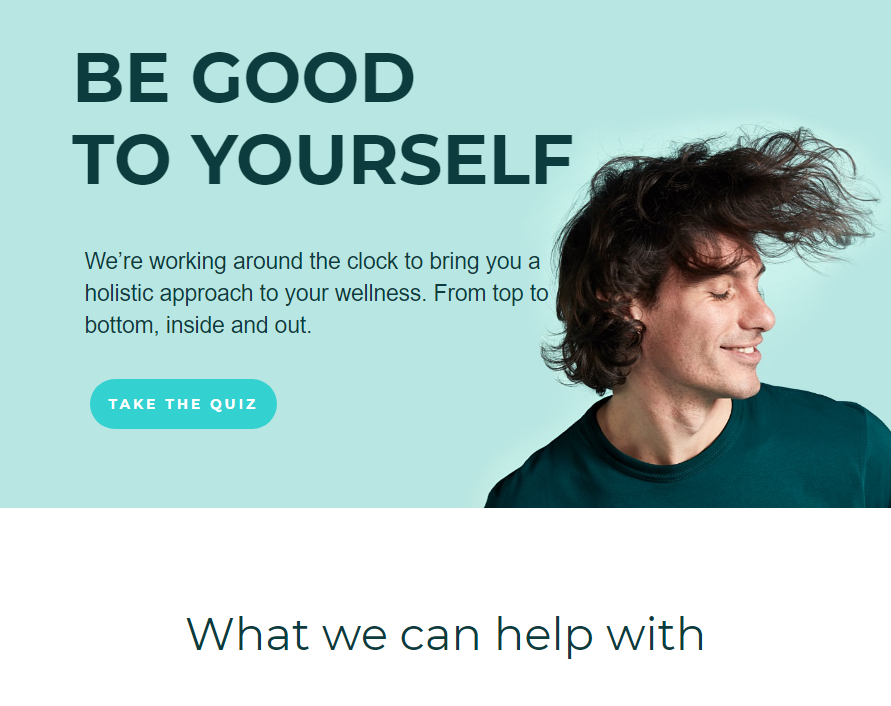
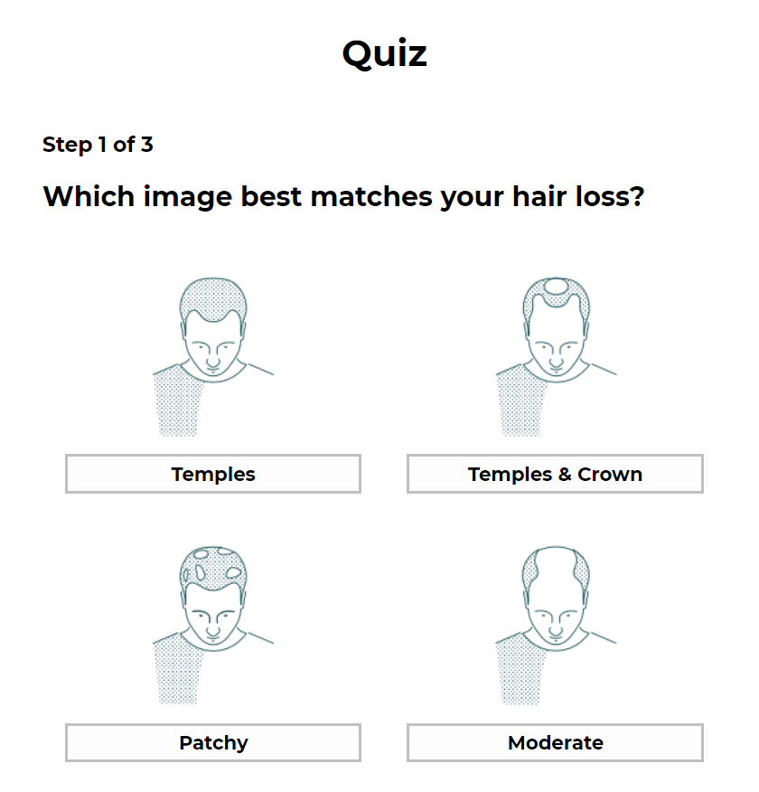

# [](https://circleci.com/gh/cypress-io/circleci-orb) 
[![Contributors][contributors-shield]][contributors-url]
[![Issues][issues-shield]][issues-url]

## Landing Page Quiz

A single landing page quiz app built with the React ad Redux frameworks to better explain Manual value proposition to users. Built as a survey experiment, that helps guide users through deciding if the product is the right fit for them.

## Table of Contents

- [User Features](#user-features)
- [Development Cycle](#development-cycle)
- [Built With](#built-with)
- [Technologies Employed](#technologies-employed)
- [Live Preview](#live-preview)
- [Required Installations](#required-installations)
- [App Installation](#instalation)
- [Future Features](#future-features)
- [Author](#author)

<!-- User features -->

## User Features

- A user accesses the single home page design.
- The user on clicking the take quiz button is shown a quiz with an array of options to choose from.
- The first question quizzes the user on his/her type of hair baldness condition.
- The second and third questions have only a true and false option.
- On answering the last question a final result is then returned to the user.
- If the user answered true in any of the last two questions a result is shown that prevents the user from accessing the medication, otherwise the user gets shown a result allowing access to the baldness medication.

## Development Cycle

- While working on the JSON object I noticed that the Images in the JSON object where made the keys of their respective Objects, and because they contained special characters it made the entire JSON object none-parseable. This is because JSON keys are expected to be just strings and not contain special characters. To fix the bug I interchanged the keys and the values of the object, thereby making the Images values in their object.
- However in the App I showcased both the keys and values of the object. So the end user result stayed the same.


|  Landing-page Screenshot | Quiz |
| ------------- | ------------- |
 | 

 <!-- BUILT WITH -->

# Built With

- VsCode
- Windows

<!-- TECHNOLOGIES EMPLOYED -->

# Technologies Employed

- React Hooks
- Redux Toolkit(RTK)
- JavaScript
- Jest auto watch
- @testing-library/react
- Cypress test tool
- CircleCI integration
- CSS Modules

<!-- LIVE PREVIEW -->

## LIVE PREVIEW

- Here is a link to the live frontend version of the app - https://queryapp.herokuapp.com/

  <!-- REQUIRED INSTALLATION -->

## REQUIRED INSTALLATIONS

- NodeJs
- npm v5.2.0+

<!-- INSTALLATION -->

## Installation of This Repository

Clone the Repository,

```Shell
your@pc:~$ git clone https://github.com/mikenath223/landing-page.git
```

Go to the downloaded folder

```Shell
your@pc:~$ cd landing-page/
```

Install all packages

```Shell
your@pc:~$ npm install
```

Start the server

```Shell
your@pc:~$ npm start
```

The app will open on your local host port 3000. [http://localhost:3000](http://localhost:3000)

<!-- run tests -->

## Run tests

Run all Jest tests

```Shell
your@pc:~$ npm test
```

Run specific Jest tests

```Shell
your@pc:~$ npm test src/tests/<testfile>
```

Run Cypress tests on browser. 
>Kindly start the server with `npm start` before running Cypress`

```Shell
your@pc:~$ npm run cypress open
```

Run specific Cypress tests on browser

```Shell
your@pc:~$ npm run cypress/integration/my-spec.js
```

Run Cypress tests on console

```Shell
your@pc:~$ npm run cypress:all --spec cypress/integration/my-spec.js>
```
- Please Refer to the [Cypress docs](https://docs.cypress.io/guides/guides/command-line.html#How-to-run-commands) for further testing options.

<!-- Future features -->

## Future Features

- Integrate CSS transitions and animations if required.

## Learn More

You can learn more in the [Create React App documentation](https://facebook.github.io/create-react-app/docs/getting-started).

To learn React, check out the [React documentation](https://reactjs.org/).
This project was bootstrapped with the create-react-app tool.

# Author

**Michgolden Ukeje**

- Github: [@mikenath223](https://github.com/mikenath223)
- Twitter: [@Michgolden_Nath](https://twitter.com/MichgoldenU)
- Linkedin: [Ukeje Michgolden](https://https://www.linkedin.com/in/michgoldenukeje/)
  <br />

<!-- MARKDOWN LINKS & IMAGES -->
<!-- https://www.markdownguide.org/basic-syntax/#reference-style-links -->

[contributors-shield]: https://img.shields.io/github/contributors/mikenath223/landing-page.svg?style=flat-square
[contributors-url]: https://github.com/mikenath223/landing-page/graphs/contributors
[forks-shield]: https://img.shields.io/github/forks/mikenath223/landing-page
[forks-url]: https://github.com/mikenath223/landing-page/network/members
[stars-shield]: https://img.shields.io/github/stars/mikenath223/landing-page
[stars-url]: https://github.com/mikenath223/landing-page/stargazers
[issues-shield]: https://img.shields.io/github/issues/mikenath223/landing-page
[issues-url]: https://github.com/mikenath223/landing-page/issues
[license-shield]: https://img.shields.io/github/license/mikenath223/landing-page
[license-url]: https://github.com/mikenath223/landing-page/blob/master/LICENSE.txt
